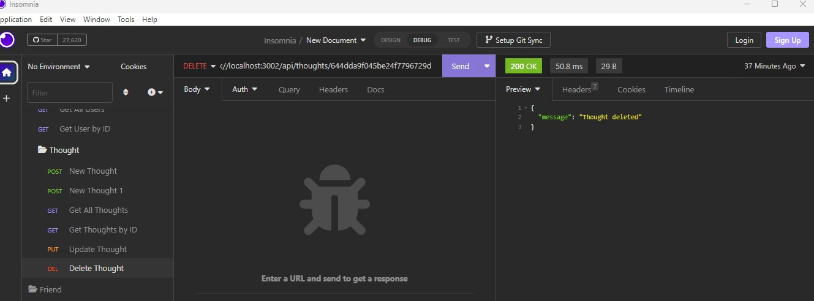

# Londa-Social-Network-API

* Actions Needed 
Built a social network API Using Express.js for routing a MongoDB database and the Mongoose ODM. This application constructs an API for a social network web application that utilizes a SQL database to effectively manage extensive volumes of unstructured data on the website.

* Actions Taken
* Created a package.json file and add dependencies with their respective versions, run 'npm init' and follow the prompts.
* Installed the express.js package for routing, run 'npm i express'.
* Installed and ran all fucnctions for Mongoose for full capability

Screenshots
* add user

* delete thought

* new thought

* Links
Video Link https://drive.google.com/file/d/1HkLOU99vCDxAzsvEDv__7EDQKQXwc98Q/view
Github Link: https://github.com/LondaNH/Londa-Social-Network-API

